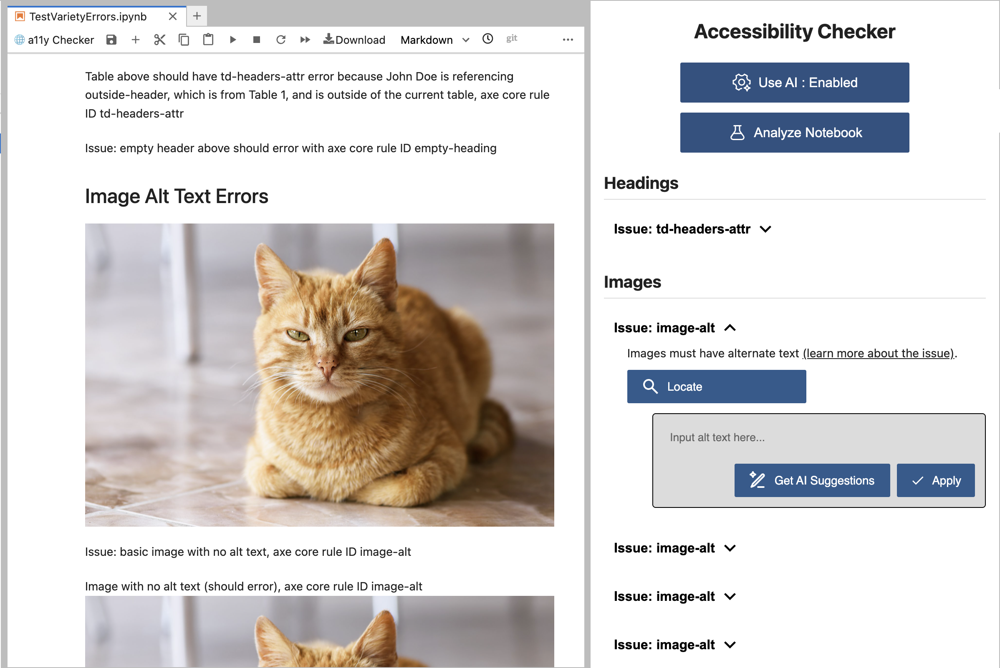

# a11y_checker

*A successor repository that will soon replace [jupyterlab-a11y-checker repository](https://github.com/berkeley-dsep-infra/jupyterlab-a11y-checker).*

This tool performs accessibility checks on Jupyter notebooks (on JupyterHub) using the [axe-core](https://github.com/dequelabs/axe-core) engine to align with WCAG guidelines. We are currently in progress of adding further checks on images, headings, color contrast, tables, and links, partially migrating some code from our [main repo](https://github.com/berkeley-dsep-infra/jupyterlab-a11y-checker).

We also utilize a Large Language Model to suggest fixes to these issues. We use ollama in JupyterHub so that no user data is transferred to third parties (we will release the specifics later).

