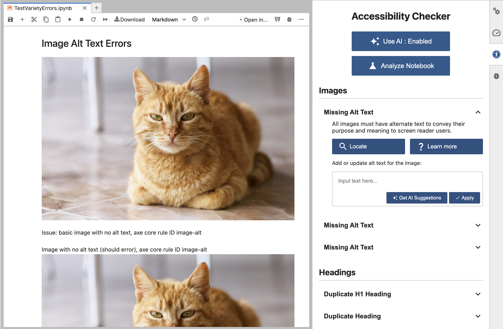

# jupyterlab-a11y-checker

*A successor repository that will soon replace [jupyterlab-a11y-checker repository](https://github.com/berkeley-dsep-infra/jupyterlab-a11y-checker).*

jupyterlab-a11y-checker is a JupyterLab extension performs accessibility checks on Jupyter Notebooks (on JupyterHub), leveraging the [axe-core engine](https://github.com/dequelabs/axe-core) and custom detection algorithms to align with WCAG 2.0 AA guidelines. It enables authors to identify accessibility issues in their notebooks and provides actionable suggestions to fix them.

## Tool Description

### Issue Detection
While there are many possible a11y issues in Jupyter Notebooks, we prioritized the issues discussed in a well-known [study](https://dl.acm.org/doi/pdf/10.1145/3597638.3608417). We utilize the [axe-core](https://github.com/dequelabs/axe-core) engine as well as custom detection algorithms. The issues the extension can detect are listed in [Issue Descriptions](./doc/rules.md).

### Fix Interfaces
We provide a user interface tailored to each issue, such as a text field for adding alt-text, a dropdown for fixing header issues, etc. The fix interfaces are listed in [Fix Interface Descriptions](./doc/fix-interfaces.md).

### AI Functionality
To simplify the remediation process, we integrate a Large Language Model (LLM) for generating recommendations. Using Ollama's mistral model, all processing is done locally on JupyterHub, ensuring user data privacy (details on this implementation will be shared in future releases).




## Getting Started

### Installing
You can install the extension directly via pip:

```bash
pip install jupyterlab-a11y-checker
```
Find the package on PyPI [here](https://pypi.org/project/jupyterlab-a11y-checker/).


### Contributing

We’re building this tool for the community, and we’d love your help! Whether it’s adding new accessibility checks, or refining the fix suggestions, your contributions can help this project make a broader impact.

#### Build from Scratch

```bash
# Create an environment using anaconda navigator: <env-name>

conda activate <env-name>
pip install cookie cutter
python -m pip install jupyterlab notebook --pre
mamba install -c conda-forge nodejs=18
node -v #to check version

# <pull code>
OR
cookiecutter https://github.com/jupyterlab/extension-cookiecutter-ts --checkout 4.0

jlpm
jlpm run build
jupyter labextension develop . --overwrite
python -m pip install -e .
pip list #to verify it has been installed in editable mode
jupyter labextension list #to verify it has been installed

jupyter lab --no-browser #run a jupyterlab server

#Run jlpm run build, then jupyter lab --no-browser to test your code after each change
```

#### Build from Temp Distribution

```bash
jlpm build:prod
npm pack #creates a tarball (*.tgz file) containing your project as it would be uploaded to the npm registry. This file can be shared and installed locally.
jupyter labextension install </path/to/your-package.tgz>


# ALTERNATIOVELY IF GIVEN A tar.gz file:

conda activate <env-name>
jupyter labextension install </path/to/your-package.tgz>
jupyter lab #this will open a local server of jupyterlab with all current extensions installed.
```

#### Pip Distribution
```bash
pip install twine

# create a ~/.pypirc file at root and add this to it:
[distutils]
index-servers =
	pypi

[pypi]
repository: https://upload.pypi.org/legacy/
username: __token__
password: your-api-token

#run this command and publish to pip.
twine upload your-package.whl
```

#### Development uninstall

```bash
pip uninstall jupyterlab_a11y_checker
```

#### Testing in a JupyterHub setup

- Build the Jupyter Lab extension with the latest changes

```bash
jlpm 
jlpm build
jupyter lab build
```
- Package the extension as a wheel file (.whl)

```bash
python -m build
```
.whl file gets generated in the `dist/` directory

- Copy the .whl file to the server where JupyterHub is installed (or include it in a Dockerfile if using Docker)

- Install the .whl file:

```bash
pip install /path/to/your-extension.whl
```

- If the identical version of the extension is already installed then

```bash
pip uninstall extension-name
pip install /path/to/your-extension.whl
```

- Refresh the page for the changes to apply

In development mode, you will also need to remove the symlink created by `jupyter labextension develop`
command. To find its location, you can run `jupyter labextension list` to figure out where the `labextensions`
folder is located. Then you can remove the symlink named `jupyterlab-a11y-checker` within that folder.


